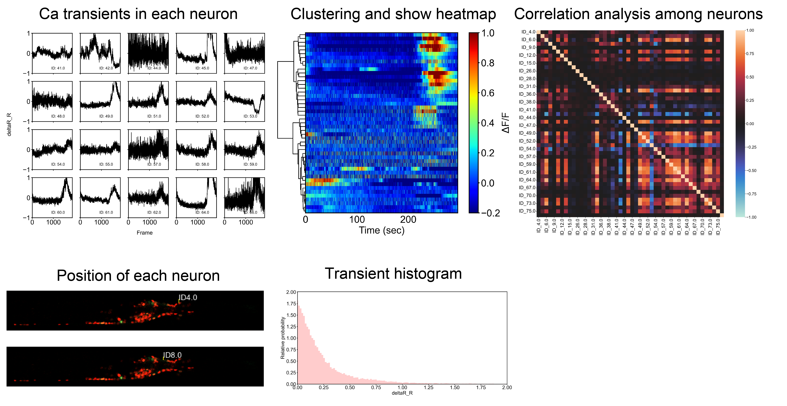

# Calcium imaging data analysis (legacy) 

## Overview

This repository is for analyzing calcium imaging data in C. elegans.   
The scripts are primarily designed for multiple neuron imaging.   
Please note that they may cause errors when used for single neuron imaging.  
## how to use
The analysis is divided into two main steps: using Trackmate (Fiji) and using custom-made scripts from this repository.  
Caution: this script may not be compatible with the files in USB drive.

### raw data
.czi (which is obtained by LSM800)

1. analysis based on Fiji and Trackmate  
   1. open .czi file with fiji (if you use 1st time, you should install TrackMate_extras-0.0.4.jar)
   2. run Trackmate 
      1. Conduct tracking (usually, diameter is 5, threshold is 0.01)
      2. save csv file (Experiment-XX.csv)  
      Note: Trackmate was updated after this script was made.   
      So, the csv file might be different from the one used in this script.  
      2024/9, I fixed the script to be compatible with the new csv file.  
      Major differences are:  
      - the first two columns of new output csv file are obstacle for the script.    
      - mean intensity column name changed from "MEAN_INTENSITY01" to "MEAN_INTENSITY_CH1"  
      3. delete first two columns of the csv file.   
   3. save .png of the color merged image (Experiment-XX.png)
   4. put the csv and png files in a directory (named as Experiment-XX)

2. Analysis using Python scripts
   1. make directories
      1. run file_move_and_make_dirs.py
      2. select the directory containing subdirectories whose names are Experiment-XX 
      3. save DIC image sequences to image_seq folder (use /file/save as/image sequences, png or tiff)
   2. analyzing data using custom made scripts 
   run Ca_imaging_daga_analysis_RR.py  
   Note: This script might give errors if there is only one track for a neuron due to the following functions:
      - correlation_among_neurons
      - intensity_histogram

4. extract and summarize the data 
   1. run data_extraction.py